# Capstone: Data Retrieval, Analysis, and Visualization with Python
## Introduction

The capstone project involves developing an ETL (Extract, Transform, Load) process for two datasets: Credit Card System and Loan Application.

The **Credit Card System** dataset represents a database used for managing credit card-related activities such as customer registration, request approvals or cancellations, and other related operations. It follows a specific architecture designed for this purpose.

The **Loan Application** dataset pertains to a bank's home loan operations. The bank operates in various areas, including urban, semi-urban, and rural regions. Customers initiate the loan application process, and the company validates their eligibility for the loan.

The goal of the capstone project is to design and implement an ETL process that extracts data from these two datasets, performs necessary transformations or data manipulations, and loads the transformed data into a target destination. This ETL process ensures the seamless integration and synchronization of the Credit Card System and Loan Application data, facilitating efficient data management and analysis for the bank.
## Architecture
 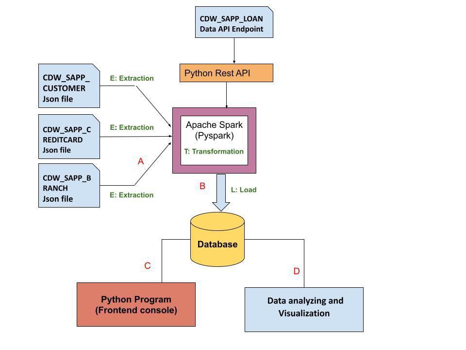

### Installation Guide
Necessary dependencies before running this application: 
* pip install findspark
* pip install pandas
* pip install matplotlib
* pip install pyspark
* pip install seaborn
* pip install regex
* pip install numpy
* pip install datetime
* pip install pymysql
* pip install requests

### Technologies
* Language: Python 3.10
* Database:MYSQL
* Libraries used in python:
* Pandas
* Matplotlib
* Seaborn
* requests
* Apache Spark(Spark Core,Spark Sql)

### Business Requirements - ETL
A credit card is issued to users to enact the payment system. It allows the 
cardholder to access financial services in exchange for the holder's promise to pay 
for them later. Below are three files that contain the customer’s transaction information 
and inventories in the credit card information.

* CDW_SAPP_CUSTOMER.JSON: This file has the existing customer details.
* CDW_SAPP_CREDITCARD.JSON: This file contains all credit card transaction information.
* CDW_SAPP_BRANCH.JSON: Each branch’s information and details are recorded in this file.

### Load Credit Card Database (SQL)
mysql << create database creditcard_capstone
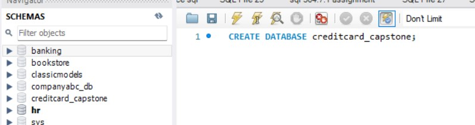
### Python and Pyspark Program to load/write the “Credit Card System Data” into RDBMS(creditcard_capstone).

1. **customer_data.py** - Extract,Transform,Load OF Customer Json Format Data Into
                     MySql Database CreditCard_Capstone.

2. **credit_data.py** - Extract,Transform,Load OF Credit_Card Json Format Data Into
                     MySql Database CreditCard_Capstone.

3. **branch_data.py** - Extract,Transform,Load OF branch_data Json Format Data Into
                     MySql Database CreditCard_Capstone.

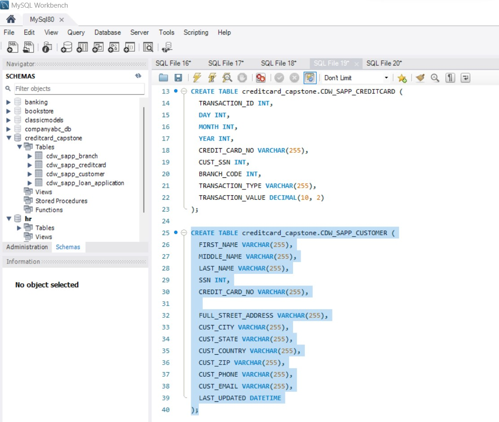
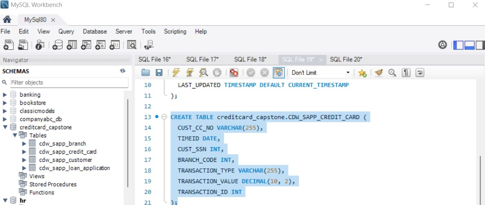
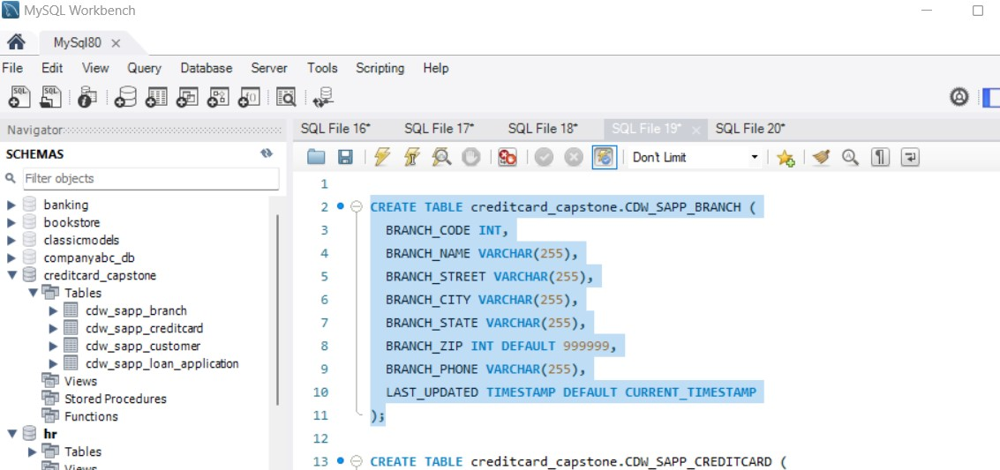

## Application Front-End
## Console-based Python program to satisfy System Requirements for Transaction and Customer
Details Modules.

## Data analysis and Visualization
To analyze and visualize the data according to the requirements.

1.Find and plot which transaction type has a high rate of transactions.

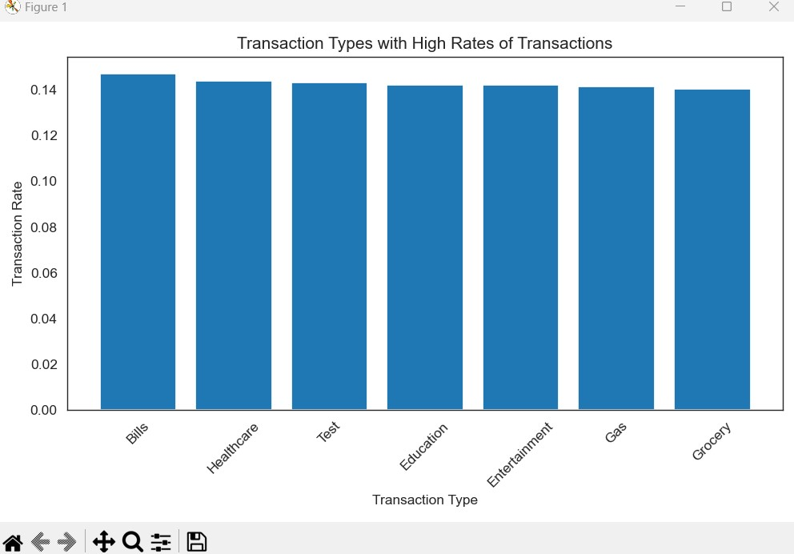

2.Find and plot which state has a high number of customers.

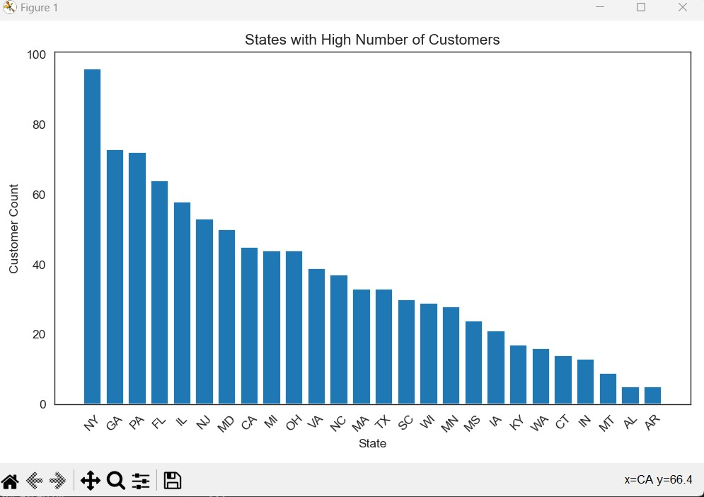

3.Find and plot the sum of all transactions for the top 10 customers, and which
customer has the highest transaction amount.hint(use CUST_SSN). 
!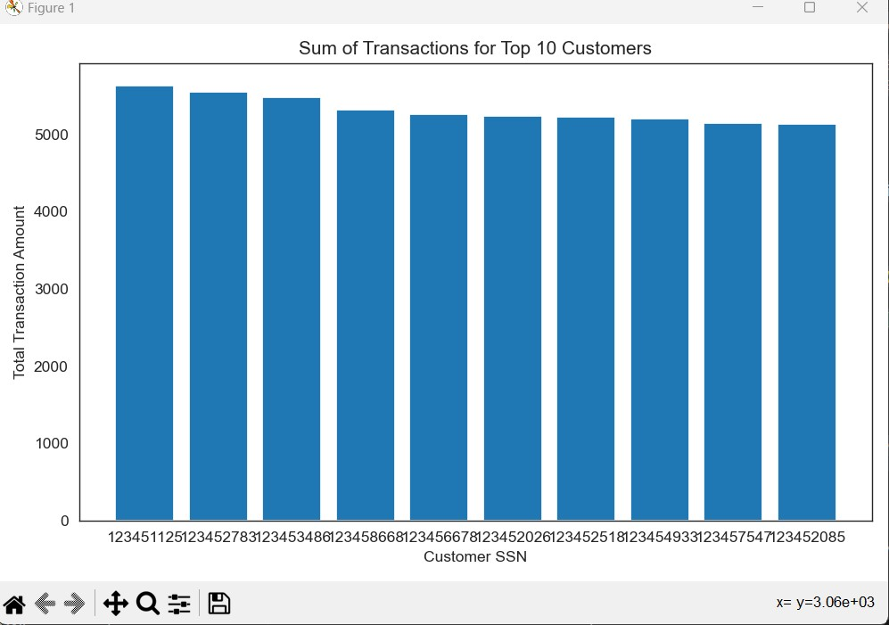

# LOAN application Data API

Banks aim to automate the loan eligibility process in real-time by leveraging customer details provided in online application forms. The key customer attributes include Gender, Marital Status, Education, Number of Dependents, Income, Loan Amount, Credit History, and more. The objective is to identify customer segments that meet the eligibility criteria for loan amounts, enabling targeted marketing efforts towards these specific customers. A partial dataset has been provided to facilitate this automation process.

API Endpoint: https://raw.githubusercontent.com/platformps/LoanDataset/main/loan_data.json
## Python and Pyspark Program to load/write the “Loan Application Data” into 
RDBMS (creditcard_capstone)
1. Loan_API.py - Python program to GET (consume) data from the above API endpoint for the loan application 
                 dataset with the status code 200.

**CDW_SAPP_loan_application**: Table with  customer home loans details.

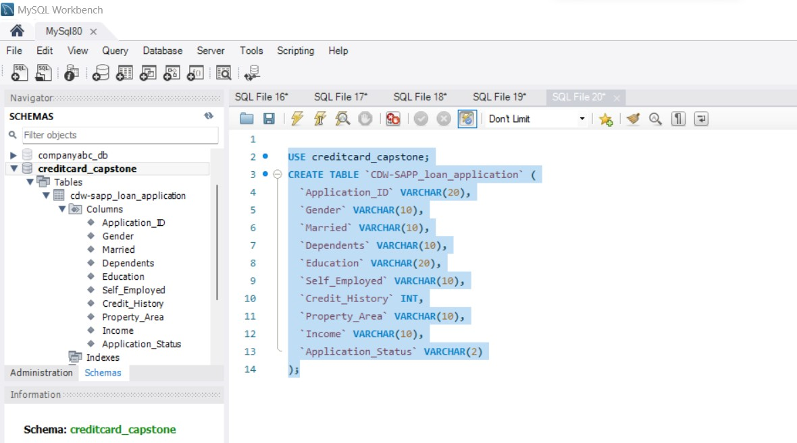

## Data analysis and Visualization
1.Find and plot the percentage of applications approved for self-employed applicants.

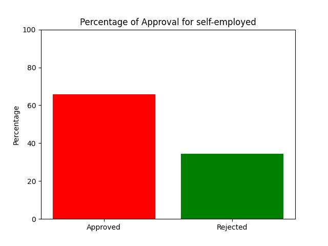

2.Find the percentage of rejection for married male applicants.

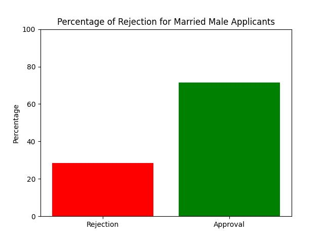

3. Find and plot the top three months with the largest transaction data.

 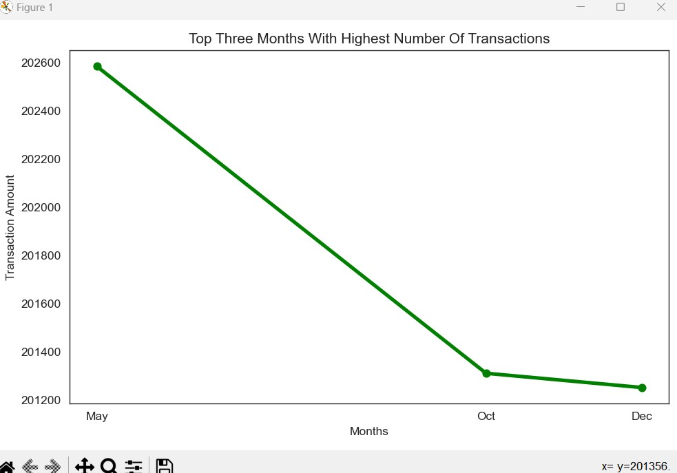

4. Find and plot which branch processed the highest total dollar value of healthcare transactions.

 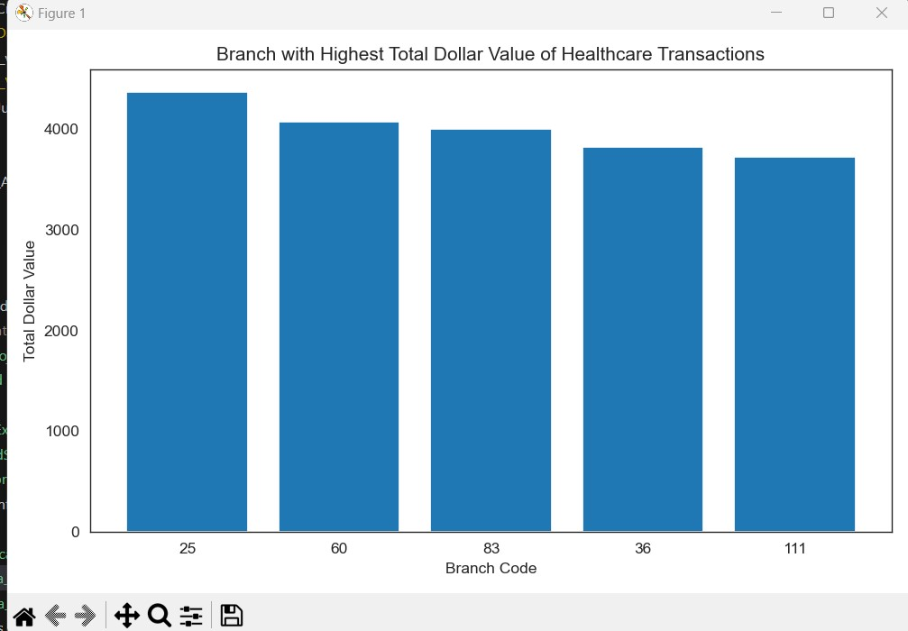
   
